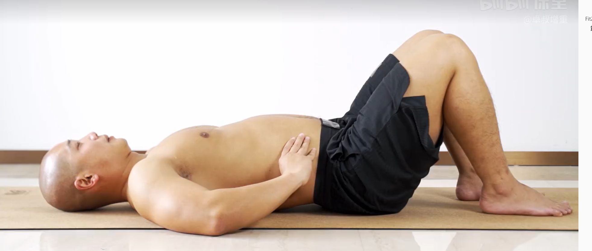
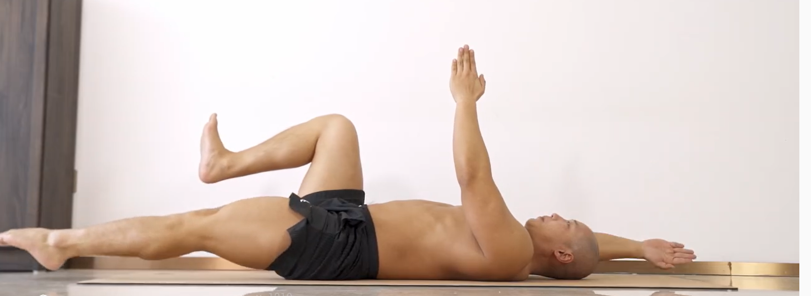
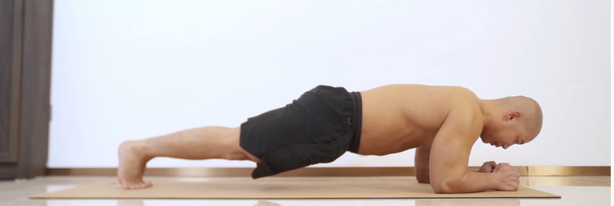
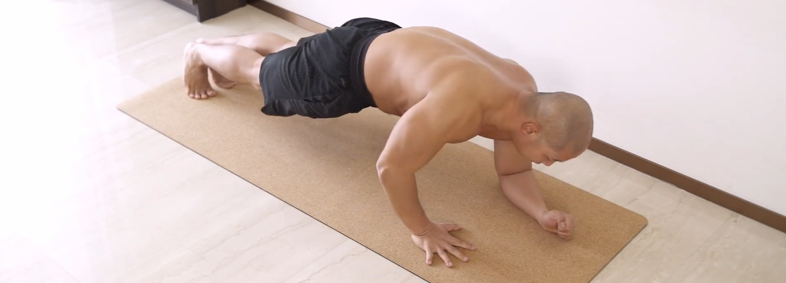

# Fit200

用两百天6个月的时间，锻炼一下自己！

## 第一周 周一，核心强化

| 序号 | 内容     | 次数                          | 是否完成 |
| :--: | :------- | :---------------------------- | -------- |
|  1   | 腹式呼吸 | 3组×20次（休息30s×3）         | - [x]    |
|  2   | 死虫子   | 3组×16次（休息30s×3）         |          |
|  3   | 平板支撑 | 3组×30秒（休息30s、30s、60s） |          |
|  4   | 平板起立 | 3组×10次（休息60s×3）         |          |

### 腹式呼吸（3组×20次）

### 死虫子（3组×16次）

### 平板支撑（3组×30秒）

### 平板起立（3组×10次）

